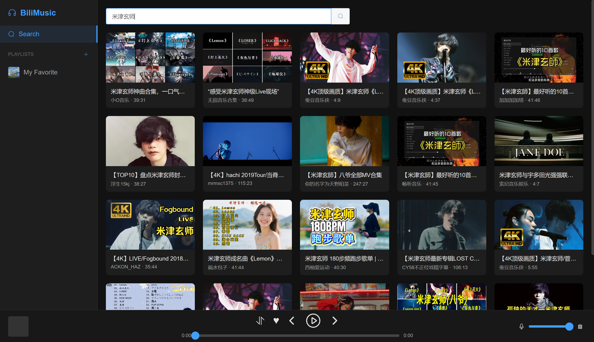

# BiliMusic 🎵

BiliMusic 是一个轻量级的桌面端音乐播放器应用。它允许你搜索 Bilibili 上的视频，提取其中的音频流进行播放，并支持本地播放列表管理。本项目采用 Python 作为后端（FastAPI），Vue 3 + Element Plus 作为前端界面，并通过 pywebview 封装为原生桌面体验。

## ✨ 主要功能

  * **🔍 视频搜索**：直接搜索 Bilibili 视频，查看封面、标题、UP主和时长。
  * **🎧 音频播放**：自动解析视频中的最佳音频流（Dash Audio），支持后台播放。
      * 支持播放模式切换：顺序播放、单曲循环、随机播放。
      * 支持音量调节和进度条拖拽。
  * **📂 播放列表管理**：
      * 创建、重命名、删除自定义播放列表。
      * 内置“我喜欢的音乐” (My Favorite) 快捷列表。
      * 支持从搜索结果快速添加歌曲到列表。
      * 支持对列表内的歌曲进行排序（代码逻辑已包含）和删除。
  * **💾 数据持久化**：所有播放列表数据存储在本地 JSON 文件中，重启后不丢失。
  * **🖥️ 现代化 UI**：基于 Element Plus 的响应式设计，简洁美观。

## 🚀 安装与运行

你可以在[这里](https://github.com/licpp/bilimusic/releases/tag/music-player)获取windows安装包。

## 📝 注意事项

1.  **网络问题**：由于 Bilibili 的防盗链机制，本项目后端实现了一个简单的音频流代理 (`/stream` 接口) 来转发音频数据，确保在播放器中能够正常播放。
2.  **API 限制**：目前使用的是未登录状态的 API 调用。大部分 360P/480P 视频对应的音频可以正常获取。如果遇到高画质/高音质专属视频，可能会无法播放（代码中预留了 `Credential` 类以便未来扩展 Cookie 登录功能）。

## 🤝 贡献

欢迎提交 Issue 或 Pull Request 来改进此项目。目前的改进方向包括：

  * 支持扫码登录以获取更高音质。
  * 支持github歌单同步。
  * 添加查看评论功能。

## 📄 开源协议

MIT License

-----

### ⚠️ 免责声明

本项目仅供学习和交流使用。所有视频及音频资源均来自 Bilibili，版权归原作者所有。请勿用于商业用途。